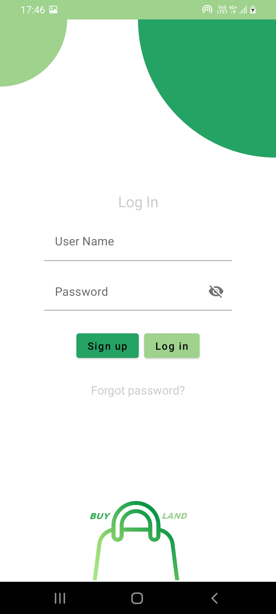

# BuyLand
Semi e-commerce application , with kotlin and Jetpack compose for view , Mvvm , Retrofit , Compose navigation , Room database with constumed queries , Offline login mechanism , The api is real one so i had to replece the key with a fake one , you can easily replace yours , Network state of devices will change the appearance of the application , Splash Screen , Gif player(with Coil) , Music player in offline mode , 
#kotlin

